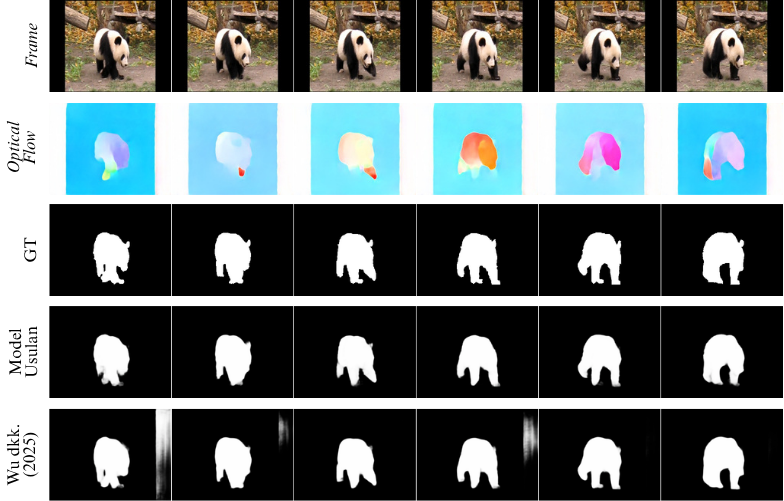

# Pengembangan Framework GAPNet Berbasis Lightweight Hybrid Backbone iFormer-T untuk Salient Object Detection Citra dan Video

Salient Object Detection (SOD) merupakan tugas computer vision untuk 
mendeteksi dan menyegmentasi objek paling menonjol pada citra maupun video. 
Pengembangan model SOD yang lightweight penting untuk implementasi pada 
perangkat dengan sumber daya terbatas. Dalam penelitian ini, model lightweight 
didefinisikan sebagai model dengan jumlah parameter < 10 juta, kompleksitas < 20 
GFLOPs, dan kecepatan inferensi ≥ 30 FPS. Lightweight backbone konvensional 
dapat menyebabkan penurunan akurasi akibat keterbatasan dalam menangkap 
representasi global. Penelitian ini bertujuan meningkatkan akurasi framework 
GAPNet dengan mengintegrasikan hybrid backbone (CNN-Transformer) 
iFormer‑T sebagai pengganti MobileNetV2. Metode yang digunakan meliputi 
integrasi backbone iFormer-T dengan channel projection layer agar kompatibel 
dengan decoder GAPNet, pelatihan pada dataset DUTS-TR untuk domain citra, 
serta fine-tuning pada DAVIS-train dan DAVSOD-train untuk domain video. 
Evaluasi dilakukan pada lima dataset SOD citra (DUTS‑TE, DUT‑OMRON, 
HKU‑IS, ECSSD, PASCAL‑S) dan empat dataset SOD video (DAVIS‑test, 
DAVSOD, SegTrack‑V2, ViSal) menggunakan metrik F‑measure, S‑measure, 
E‑measure, MAE serta metrik lightweightness berupa parameter, GFLOPs, dan 
FPS. Hasil menunjukkan integrasi iFormer‑T menghasilkan representasi fitur yang 
lebih koheren berdasarkan analisis visual representasi fitur dan memperoleh rata
rata peningkatan absolut sebesar 0,008 pada dataset citra dan 0,022 pada dataset 
video dibandingkan MobileNetV2. Model mencapai 4,56 juta parameter, 2,25 
GFLOPs, dan 246 FPS untuk SOD citra, serta 8,05 juta parameter, 4,40 GFLOPs, 
dan 30 FPS untuk SOD video. Secara keseluruhan, integrasi iFormer-T mampu 
meningkatkan akurasi tanpa mengorbankan karakteristik lightweight, meskipun 
adaptasi temporal dan penanganan adegan kompleks, misalnya clutter dan kontras 
rendah, memerlukan pengembangan lebih lanjut.

Repositori penelitian ini dibangun dengan mengacu pada repositori Wu dkk. (2025), yang telah di-fork dan dikembangkan lebih lanjut:

```bibtex
@article{wu2025gapnet,
  title     = {GAPNet: A Lightweight Framework for Image and Video Salient Object Detection via Granularity-Aware Paradigm},
  author    = {Yu-Huan Wu and Wei Liu and Shi-Chen Zhang and Zizhou Wang and Yong Liu and Liangli Zhen},
  journal   = {Machine Intelligence Research},
  year      = {2025},
}
```

<h3>Perbandingan Kualitatif Citra</h3>
<div style="background-color:white; display:inline-block; padding:10px;">
  
</div>

<h3>Perbandingan Kualitatif Video</h3>
<div style="background-color:white; display:inline-block; padding:10px;">
  
</div>
